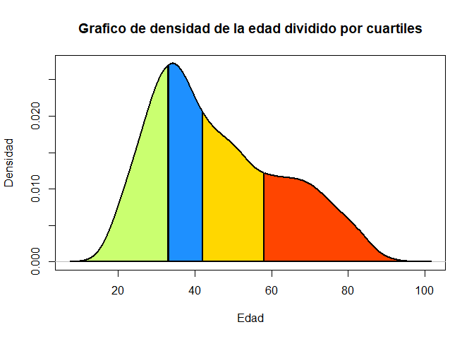

<!-- README.md is generated from README.Rmd. Please edit that file -->
BIENVENIDOS!!!
==============

EN LA SIGUIENTE GUÍA SE MOSTRARÁ COMO USAR EL PAQUETE DATAMETRÍA.
=================================================================

FUNCIONES.
----------

El paquete está en pleno desarrollo, por el momento sólo contamos con 7 funciones:

1.  **limpiecito**: Esta función limpia elementos o vectores caracter, quitando las tildes, espacios en blanco al inicio, entre caracteres y al final. Tiene la opción de arrojar los resultados en minúsculas o mayúsculas.
2.  **estadisticos**: Esta función permite calcular los principales estadísticos como: la media, mediana, desviación estándar, mínimo, máximo, coeficiente de variación y el total de observaciones.
3.  **dpto\_peru**: Esta función permite convertir el ubigeo de las regiones de Perú a su descripción, es decir, al nombre de la región.
4.  **n\_percentil**: Esta función permite calcular el número de elementos de un vector que pertenecen a un determinado percentil. Arroja los resultados mostrando los puntos de corte o por bloques determinados por el percentil.
5.  **test\_grubbs**: Test que permite determinar si un elemento de un vector es outliers, mediante el test de grubss. Esta función tiene la opción de arrojar como resultado un valor lógico o todos los estadísticos de grubbs que se usaron para determinar si es o no outliers.
6.  **grubss\_total**: Esta función realiza, el test de grubbs, que sirve para determinar si uno o varios elementos del vector son outliers.
7.  **area\_quantile**: Esta función grafica la funciones de densidad y divide el gráfico por percetiles.
8. **bcrp**: Esta función permite descargar las series económicas del BCRP automáticamente usando el método de web scraping. 

Para usar el paquete primero se tiene que instalar el paquete `devtools` (si aún no lo tienes instalado).

``` r
install.packages("devtools")
```

Una vez instalado `devtools`, se procede a descargar el paquete `datametria`, para lo cual digitamos el siguiente código:

``` r
devtools::install_github("CesarAHN/datametria")
```

Una vez descargado, se tiene que cargar el paquete `datametria`. Para esto corremos el siguiente código:

``` r
library(datametria)
```

EJEMPLOS DE COMO USAR LAS FUNCIONES:
------------------------------------

### FUNCIÓN limpiecito():

La función `limpiecito()` es una función para limpiar espacios por demás al inicio, final o intermedio. Asimismo elimina tildes y arroja los resultados en letras mayúsculas o minúsculas. Esta función sólo recibe dos parámetros: `x` que es un elemento o vector caracter y `capital` que es un valor lógico que si toma el valor de `TRUE` arrojará los resultados en mayúsculas, mientras que si toma el valor `FALSE` arrojará los resultados en minúsuculas, el valor por defecto es `TRUE`.

Veamos un ejemplo de uso.

Si se tiene el siguiente vector:

``` r
x<-c("   mucho    espacio", "VAYA      de     espacios    ", "CÓMO se hicieron    tantos espacios   ")
x
# [1] "   mucho    espacio"                   
# [2] "VAYA      de     espacios    "         
# [3] "CÓMO se hicieron    tantos espacios   "
```

Como se puede ver el vector `x` tiene 3 elementos caracter y cada elemento tienen más de un espacio ya sea al inicio, intermedio o fin, además hay palabras con mayúscula y minúsculas, y por último, palabras con tildes. Entonces, si queremos que el vector `x` tenga una estructura homogénea tendremos que usar la función `limpiecito()`.

Veamos como:

``` r
# Si deseamos que los resultados del vector x sean mayúsculas.
limpiecito(x)
# [1] "MUCHO ESPACIO"                    "VAYA DE ESPACIOS"                
# [3] "COMO SE HICIERON TANTOS ESPACIOS"
```

Gracias a la función `limpiecito()` se ha podido eliminar los espacios y homogenizar las palabras quitandole las tíldes y convirtiendo todo a mayúscula.

Pero si nosotros deseamos que los resultados estén en minúsculas, entonces, usaremos el argumento `capital`. Veamos como:

``` r
# Si deseamos que los resultados del vector x sean minúsculas.
limpiecito(x, capital = FALSE)
# [1] "mucho espacio"                    "vaya de espacios"                
# [3] "como se hicieron tantos espacios"
```

### FUNCIÓN estadísticos():

Esta función se usa para calcular los principales estadísticos como: la media, mediana, desviación estándar, mínimo, máximo, coeficiente de variación y el total de observaciones. Solo recibe 2 argumentos: `x` que tiene que ser un vector numérico y `miss` que toma un valor lógico, si es `TRUE` entonces para el cálculo de los estadísticos no se toma en cuenta los **missings values**, por el contrario si es `FALSE` si se toma en consideración los **missings values**.

Veamos un ejemplo de como usarlo. Pero primero carguemos una tabla de datos `gender`, para cargarlo usamos la siguiente sintaxis.

``` r
df<-read.csv("http://r.datametria.com/wp-content/uploads/2020/08/gender.csv", sep = ";")

# Viendo las 5 primeras filas del data frame.
head(df)
#   income educ jobexp female
# 1    5.0    2      3      0
# 2    9.7    4     18      1
# 3   28.4    8     11      1
# 4    8.8    8     12      1
# 5   21.0    8     14      0
# 6   26.6   10     13      0
```

Tenemos los ingresos (`income`), los años de educación (`educ`), los años de experiencia (`jobexp`) y el género (`female`).

Entonces si nosotros queremos sacar los principales estadísticos de los ingresos vamos a usar la función `estadisticos()`.

``` r
estadisticos(df$income)
#                   [,1]
# MEDIA           24.415
# MEDIANA         24.800
# DESV.STAND.      9.550
# MÍNIMO           5.000
# MÁXIMO          48.300
# COEF.VARIACIÓN   0.391
# N              500.000
```

En efecto, hemos logrado obtener los principales estadísticos de los ingresos. Pero si deseo no solo de los ingresos sino también de los años de educación y los años de experiencia, entonces usaría la siguiente sintaxis.

``` r
do.call(cbind,lapply(df[,1:3], estadisticos))
#                   [,1]    [,2]    [,3]
# MEDIA           24.415  10.900  13.150
# MEDIANA         24.800  12.000  12.500
# DESV.STAND.      9.550   3.690   4.612
# MÍNIMO           5.000   2.000   3.000
# MÁXIMO          48.300  17.000  23.000
# COEF.VARIACIÓN   0.391   0.339   0.351
# N              500.000 500.000 500.000
```

### FUNCIÓN dpto\_peru():

Esta función nos permite obtener los nombres de las regiones cuando ingresamos el número de ubigeo, también si sólo le indicamos los cuatro o dos primeros números del ubigeo. Sólo necesita un argumento el cual es `x` que es un elemento o vector numérico o caracter.

Para ver un ejemplo carguemos la tabla de datos de la ENAHO del 2019, en donde se tiene en consideración el ubigeo de los encuestados.

``` r
df<-read.table("http://r.datametria.com/wp-content/uploads/2020/09/enaho_2019.txt", colClasses = "character")
```

El archivo pesa 7MB puede que tarde un poco la descarga de la tabla. Una ve que ha cargado la tabla, podemos ver las 5 primeras filas.

``` r
head(df)
#   conglome vivienda hogar codperso ubigeo         facpob07
# 1   005009      041    11       01 010101 94.2182083129883
# 2   005009      041    11       02 010101 94.2182083129883
# 3   005009      056    11       01 010101 94.2182083129883
# 4   005009      056    11       02 010101 94.2182083129883
# 5   005009      056    11       03 010101 94.2182083129883
# 6   005009      056    11       04 010101 94.2182083129883
```

Vemos que la variable ubigeo es una vector con elementos de 6 caracteres. Entonces, si nosotros queremos colocar los nombres de las regiones dado este ubigeo, tedríamos que usar la siguiente sintaxis.

``` r
df$region<-dpto_peru(df$ubigeo)
```

Viendo las 5 primeras filas.

``` r
head(df)
#   conglome vivienda hogar codperso ubigeo         facpob07   region
# 1   005009      041    11       01 010101 94.2182083129883 AMAZONAS
# 2   005009      041    11       02 010101 94.2182083129883 AMAZONAS
# 3   005009      056    11       01 010101 94.2182083129883 AMAZONAS
# 4   005009      056    11       02 010101 94.2182083129883 AMAZONAS
# 5   005009      056    11       03 010101 94.2182083129883 AMAZONAS
# 6   005009      056    11       04 010101 94.2182083129883 AMAZONAS
```

En efecto podemos ver que en la columna región ahora se muestran los nombres de las regiones.

Pero se puede dar el caso que sólo tienes un vector en donde sólo se tiene los dos primeros dígitos del ubigeo. Hagamos un ejemplo, en donde se muestre el vector con sólo dos caracteres.

``` r
# Para esto se usará la función substring.
df$region2<-substring(df$ubigeo, 1,2)

# Convirtiendo este vector para que arroje los nombres de las regiones. 
df$region2_a<-dpto_peru(df$region2)

# Viendo las 5 primeras filas.
head(df)
#   conglome vivienda hogar codperso ubigeo         facpob07   region region2
# 1   005009      041    11       01 010101 94.2182083129883 AMAZONAS      01
# 2   005009      041    11       02 010101 94.2182083129883 AMAZONAS      01
# 3   005009      056    11       01 010101 94.2182083129883 AMAZONAS      01
# 4   005009      056    11       02 010101 94.2182083129883 AMAZONAS      01
# 5   005009      056    11       03 010101 94.2182083129883 AMAZONAS      01
# 6   005009      056    11       04 010101 94.2182083129883 AMAZONAS      01
#   region2_a
# 1  AMAZONAS
# 2  AMAZONAS
# 3  AMAZONAS
# 4  AMAZONAS
# 5  AMAZONAS
# 6  AMAZONAS
```

En efecto, se ha obtenido los nombres de las regiones.

Esta función también sirve si sólo tienes en consideración los 4 primeros caracteres del ubigeo, incluso si el vector de ubigeos es numérico.

Veamos un ejemplo para el caso de vectores numéricos.

``` r
# Vamos a convertir a numérico el vector region2 que tiene sólo dos caracteres. 
df$region3<-as.numeric(df$region2)

# Convirtiendo este vector para que arroje los nombres de las regiones. 
df$region3_a<-dpto_peru(df$region3)

# Viendo las 5 primeras filas.
head(df)
#   conglome vivienda hogar codperso ubigeo         facpob07   region region2
# 1   005009      041    11       01 010101 94.2182083129883 AMAZONAS      01
# 2   005009      041    11       02 010101 94.2182083129883 AMAZONAS      01
# 3   005009      056    11       01 010101 94.2182083129883 AMAZONAS      01
# 4   005009      056    11       02 010101 94.2182083129883 AMAZONAS      01
# 5   005009      056    11       03 010101 94.2182083129883 AMAZONAS      01
# 6   005009      056    11       04 010101 94.2182083129883 AMAZONAS      01
#   region2_a region3 region3_a
# 1  AMAZONAS       1  AMAZONAS
# 2  AMAZONAS       1  AMAZONAS
# 3  AMAZONAS       1  AMAZONAS
# 4  AMAZONAS       1  AMAZONAS
# 5  AMAZONAS       1  AMAZONAS
# 6  AMAZONAS       1  AMAZONAS
```

Y como se mencionó se obtuvieron los nombres de las regiones. Para poder ver el número de encuestados por regiones vamos a realizar una tabla, no se va a considerar el factor de expansión porque el objetivo de esta guía no es aquello.

``` r
# Creando la tabla. 
table(df$region)
# 
#      AMAZONAS        ANCASH      APURIMAC      AREQUIPA      AYACUCHO 
#          4801          5448          3135          5478          3846 
#     CAJAMARCA        CALLAO         CUSCO  HUANCAVELICA       HUANUCO 
#          4704          3852          4374          3518          4823 
#           ICA         JUNIN   LA LIBERTAD    LAMBAYEQUE          LIMA 
#          5468          5483          6161          5908         16732 
#        LORETO MADRE DE DIOS      MOQUEGUA         PASCO         PIURA 
#          7214          2271          2949          3150          6959 
#          PUNO    SAN MARTÍN         TACNA        TUMBES       UCAYALI 
#          3937          5195          4485          3119          5266
```

### FUNCIÓN n\_percentil():

Esta función permite calcular el número de elementos de un vector que pertenecen a un determinado percentil. Arroja los resultados mostrando los puntos de corte o por bloques determinados por el percentil. Esta función tiene 3 argumentos: `x` que tiene que ser un vector numérico, `len` que es el número de cortes que se desea realizar, el valor por defecto es 4, es así que arrojará el número de elementos por cuartiles. Por último, el argumento `p_corte` que es un valor lógico que toma el valor por defecto de `TRUE`, lo que indica que en los resultados se muestre el número de puntos de corte, en el caso de que `len` sea 4, entonces mostrará los elementos en 4 bloques; y si toma el valor de `FALSE` entonces mostrará los resultados con los puntos de corte.

Veamos algunos ejemplos, pero primero cargamos la tabla de datos gender.

``` r
# Cargamos la tabla de datos gender.
df<-read.csv("http://r.datametria.com/wp-content/uploads/2020/08/gender.csv", sep = ";")

# Viendo las 5 primeras filas del data frame.
head(df)
#   income educ jobexp female
# 1    5.0    2      3      0
# 2    9.7    4     18      1
# 3   28.4    8     11      1
# 4    8.8    8     12      1
# 5   21.0    8     14      0
# 6   26.6   10     13      0
```

Vamos a calcular el número de personas por cuartil de los ingresos. Recordar que el cuartil divide en 4 a nuestros datos y el valor por defecto de `len` es 4.

``` r
n_percentil(df$income)
#             [,1]
# [5,21.5]     125
# (21.5,24.8]  150
# (24.8,28.4]  100
# (28.4,48.3]  125
```

En efecto, calcula el número de elementos por cuartil. Así tenemos que en el primer cuartil hay 125 elementos que van desde 5 a 21.5, luego 150 elementos desde mayores a 21.5 y menores iguales 24.8 y así sucesivamente.

Pero si no deseamos verlo con los puntos de corte y sólo queremos ver los bloques por percentil, entonces, tendremos que usar el argumento `p_corte` y asignarle el valor de `FALSE`. Veamos un ejemplo, pero ahora para los quintiles.

``` r
n_percentil(df$income, len = 3, p_corte = FALSE)
#   [,1]
# 1  175
# 2  175
# 3  150
```

Podemos ver que en el primer tercil se encuentran 175 elementos, igual en el segundo tercil, por último, el tercer tercil cuenta con 150 elementos.

### FUNCIÓN test\_grubbs().

Esta función nos permite determinar si un elemento de un vector es outliers, mediante el test de grubss. Esta función tiene la opción de arrojar como resultado un valor lógico o todos los estadísticos de grubbs que se usaron para determinar si es o no outliers.

Esta función tiene 5 argumentos: `x1` es el elemento del cual se desea saber si es un outliers, `x` es el vector numérico que contiene a `x1`, `alpha` indica el nivel de significancia con los que se desea realizar el test de grubbs, esto nos permite calcular el valor o valores críticos del test, su valor por defecto es de 0.05 (5%), `num_colas` es un valor numérico que toma por defecto 2, lo que indica que el análisis se hará a dos colas y si toma el valor de 1, el análisis se hará a una cola, por último, el argumento `vista` que es un elemento lógico en donde si toma el valor de `TRUE` entonces se muestren el valor estadístico del test de grubbs, el valor crítico del test de grubbs, la comparación que se hace y el resultado que es un valor lógico TRUE o FALSE, donde TRUE indica que el elemento es un outliers.

Para ver un ejemplo, carguemos la tabla de datos llamada `outlier`.

``` r
# Cargamos la base de datos.
df<-read.table("https://r.datametria.com/wp-content/uploads/2020/09/outlier.txt")

# Veamos las 5 primeras filas.
head(df)
#           dv         iv
# 1 99.0000000   6.599043
# 2 -1.8106215 -19.526001
# 3 -2.2611923 -17.248777
# 4 -2.3658385 -13.970714
# 5  0.2142442   7.496106
# 6  0.7658228   3.025579
```

Podemos darnos cuenta que el primer elemento del vector `dv` es 99 y quizá pueda ser un outlier. Entonces, veamos si el primer elemento de la variable `dv` es un outlier.

``` r
test_grubbs(df$dv[1], df$dv, vista = FALSE)
# [1] TRUE
```

Como podemos ver con `df$dv[1]` le estamos diciendo que seleccione al primer elemento del vector `df`. Y nos arrojó el valor de `TRUE`, lo cual indica que el primer elemento de la variable `dv` es un outlier.

Recordar que el test lo realizó a dos colas y con un nivel de significancia del 0.05. Pero como se mencionó anteriormente, podemos ver el estadístico de grubbs, su valor crítico y la elección.

``` r
test_grubbs(df$dv[1], df$dv)
# $Grubbs_test
# [1] 5.148213
# 
# $Grubbs_critico
# [1] 3.036097
# 
# $Elección
# [1] "5.14821340734902>3.03609738451121"
# 
# $Resultado
# [1] TRUE
```

En efecto, el estadistico de grubss es de 5.1482 y el valor crítico de es de 3.036 y si comparamos podemos ver que el estadístico de grubbs es mayor al valor crítico, por tanto, es un outlier.

Pero si nosotros deseamos calcular si más de un elemento es un valor outlier entonces, tendríamos que recurrir a un `for`, pero no será necesario ya que contamos con la función `grubbs_total` que puede hacer todo el procedimiento sin necesidad de hacer el `for`.

### FUNCIÓN grubbs\_total():

Esta función realiza, el test de grubbs, pero a más de un elemento.

Esta función sólo cuenta con tres argumentos: `x` que es el vector de donde se desea saber el número de elementos que podrían ser outliers, esea saber si es un outliers, `x` es el vector numérico que contiene a `x1`, `alpha` que indica el nivel de significancia con los que se desea realizar el test de grubbs, esto nos permite calcular el valor o valores críticos del test, su valor por defecto es de 0.05 (5%), `num_colas` es un valor numérico que toma por defecto 2, lo que indica que el análisis se hará a dos colas y si toma el valor de 1, el análisis se hará a una cola.

Para poder ver un ejemplo carguemos la tabla de datos `binlfp4` que contiene información sobre la participación de las mujeres en la fuerza laboral.

``` r
# Cargando la base de datos.
df<-read.table("http://r.datametria.com/wp-content/uploads/2020/09/binlfp4.txt")

# Viendo las 5 primeras filas. 
head(df)
#   caseid lfp k5 k618 age wc hc       lwg    inc age3039 age4049 age50plus
# 1      1   0  0    3  39  0  0 0.8532125 28.363       1       0         0
# 2      2   0  0    0  60  0  0 1.2249736 24.984       0       0         1
# 3      3   0  0    0  43  0  0 0.8881401  9.952       0       1         0
# 4      4   0  2    3  31  0  0 1.1580402 10.000       1       0         0
# 5      5   0  0    2  40  1  1 1.0828638 28.200       0       1         0
# 6      6   0  0    2  36  0  0 0.8895015  5.330       1       0         0
#   agecat k5_0 k5_1 k5_2 k5_2plus k5_3 k5cat k618_0 k618_1 k618_23 k618_4plus
# 1      1    1    0    0        0    0     0      0      0       1          0
# 2      3    1    0    0        0    0     0      1      0       0          0
# 3      2    1    0    0        0    0     0      1      0       0          0
# 4      1    0    0    1        1    0     2      0      0       1          0
# 5      2    1    0    0        0    0     0      0      0       1          0
# 6      1    1    0    0        0    0     0      0      0       1          0
#   k618cat    wages
# 1       2 2.347175
# 2       0 3.404076
# 3       0 2.430605
# 4       2 3.183688
# 5       2 2.953125
# 6       2 2.433916
```

Podemos ver la columna `inc` el cual representa el ingreso de las familias exceptuando el de las esposas.

Entonces, si nosotros queremos saber cuales de esos ingresos son outliers por el método de grubbs, tendremos que usar nuestra función `grubbs_total`.

``` r
grubbs_total(df$inc)
#   [1] FALSE FALSE FALSE FALSE FALSE FALSE FALSE FALSE FALSE FALSE FALSE FALSE
#  [13] FALSE FALSE FALSE FALSE FALSE FALSE FALSE FALSE FALSE FALSE FALSE FALSE
#  [25]  TRUE  TRUE FALSE FALSE FALSE FALSE FALSE FALSE FALSE FALSE FALSE FALSE
#  [37] FALSE FALSE FALSE FALSE FALSE FALSE FALSE FALSE FALSE FALSE FALSE FALSE
#  [49] FALSE FALSE FALSE FALSE FALSE FALSE FALSE FALSE FALSE FALSE FALSE FALSE
#  [61] FALSE FALSE FALSE FALSE FALSE FALSE FALSE FALSE FALSE FALSE FALSE FALSE
#  [73] FALSE FALSE FALSE FALSE FALSE FALSE FALSE FALSE FALSE FALSE FALSE FALSE
#  [85] FALSE FALSE FALSE FALSE FALSE FALSE FALSE FALSE FALSE FALSE FALSE FALSE
#  [97] FALSE FALSE FALSE FALSE FALSE FALSE FALSE FALSE FALSE FALSE  TRUE FALSE
# [109] FALSE FALSE FALSE FALSE FALSE FALSE FALSE FALSE FALSE FALSE FALSE FALSE
# [121] FALSE FALSE FALSE FALSE FALSE FALSE FALSE FALSE FALSE FALSE FALSE FALSE
# [133] FALSE FALSE FALSE FALSE FALSE FALSE FALSE FALSE FALSE FALSE FALSE FALSE
# [145] FALSE FALSE FALSE FALSE FALSE FALSE FALSE FALSE FALSE FALSE FALSE FALSE
# [157] FALSE  TRUE FALSE FALSE FALSE FALSE FALSE FALSE FALSE FALSE FALSE FALSE
# [169] FALSE FALSE FALSE FALSE FALSE FALSE FALSE FALSE FALSE FALSE FALSE FALSE
# [181] FALSE FALSE FALSE FALSE FALSE FALSE FALSE FALSE FALSE FALSE FALSE FALSE
# [193] FALSE FALSE FALSE FALSE FALSE FALSE FALSE FALSE FALSE FALSE FALSE FALSE
# [205] FALSE FALSE FALSE FALSE FALSE FALSE FALSE FALSE FALSE FALSE FALSE FALSE
# [217] FALSE FALSE FALSE FALSE FALSE FALSE FALSE FALSE FALSE FALSE FALSE FALSE
# [229] FALSE FALSE FALSE FALSE FALSE FALSE FALSE FALSE FALSE FALSE FALSE FALSE
# [241] FALSE FALSE FALSE FALSE FALSE FALSE FALSE FALSE FALSE FALSE FALSE FALSE
# [253] FALSE FALSE FALSE FALSE FALSE FALSE FALSE FALSE FALSE FALSE FALSE FALSE
# [265] FALSE FALSE FALSE FALSE FALSE  TRUE FALSE FALSE FALSE FALSE FALSE FALSE
# [277] FALSE FALSE FALSE FALSE FALSE FALSE FALSE FALSE FALSE FALSE FALSE FALSE
# [289] FALSE FALSE FALSE FALSE FALSE FALSE FALSE FALSE FALSE FALSE FALSE FALSE
# [301] FALSE FALSE FALSE FALSE FALSE FALSE FALSE FALSE FALSE FALSE FALSE FALSE
# [313] FALSE FALSE FALSE FALSE FALSE FALSE FALSE FALSE FALSE FALSE FALSE FALSE
# [325] FALSE FALSE FALSE FALSE FALSE FALSE FALSE FALSE FALSE FALSE FALSE FALSE
# [337] FALSE FALSE FALSE FALSE FALSE FALSE FALSE FALSE FALSE FALSE FALSE FALSE
# [349] FALSE FALSE FALSE FALSE FALSE FALSE FALSE FALSE FALSE FALSE FALSE FALSE
# [361] FALSE FALSE FALSE FALSE FALSE FALSE FALSE  TRUE FALSE FALSE FALSE FALSE
# [373] FALSE FALSE FALSE FALSE FALSE FALSE FALSE FALSE FALSE FALSE FALSE FALSE
# [385] FALSE FALSE FALSE FALSE FALSE FALSE FALSE FALSE FALSE FALSE FALSE FALSE
# [397] FALSE FALSE FALSE FALSE FALSE FALSE FALSE FALSE FALSE FALSE FALSE FALSE
# [409] FALSE FALSE FALSE FALSE FALSE FALSE FALSE FALSE FALSE FALSE FALSE FALSE
# [421] FALSE FALSE FALSE FALSE FALSE FALSE FALSE FALSE FALSE FALSE FALSE FALSE
# [433] FALSE FALSE FALSE FALSE FALSE FALSE FALSE FALSE FALSE FALSE FALSE FALSE
# [445] FALSE FALSE FALSE FALSE FALSE FALSE FALSE FALSE FALSE FALSE FALSE FALSE
# [457] FALSE FALSE FALSE FALSE FALSE FALSE FALSE FALSE FALSE FALSE FALSE FALSE
# [469] FALSE FALSE FALSE FALSE FALSE FALSE FALSE FALSE FALSE FALSE FALSE FALSE
# [481] FALSE FALSE FALSE FALSE FALSE FALSE FALSE FALSE FALSE FALSE FALSE FALSE
# [493] FALSE FALSE FALSE FALSE FALSE FALSE FALSE FALSE FALSE FALSE FALSE FALSE
# [505] FALSE FALSE FALSE FALSE FALSE FALSE FALSE FALSE FALSE FALSE FALSE FALSE
# [517] FALSE FALSE FALSE FALSE FALSE FALSE FALSE FALSE FALSE FALSE FALSE FALSE
# [529] FALSE FALSE FALSE FALSE FALSE FALSE FALSE FALSE FALSE FALSE FALSE FALSE
# [541] FALSE FALSE FALSE FALSE FALSE FALSE FALSE FALSE FALSE FALSE FALSE FALSE
# [553] FALSE FALSE FALSE FALSE FALSE FALSE FALSE FALSE FALSE FALSE FALSE FALSE
# [565] FALSE FALSE FALSE FALSE FALSE FALSE FALSE FALSE FALSE FALSE FALSE FALSE
# [577] FALSE FALSE FALSE FALSE FALSE FALSE FALSE FALSE FALSE FALSE FALSE FALSE
# [589] FALSE FALSE FALSE FALSE FALSE FALSE FALSE FALSE FALSE FALSE FALSE FALSE
# [601] FALSE FALSE FALSE FALSE FALSE FALSE FALSE FALSE FALSE FALSE FALSE FALSE
# [613] FALSE FALSE FALSE FALSE FALSE FALSE FALSE FALSE FALSE FALSE FALSE FALSE
# [625] FALSE FALSE FALSE FALSE FALSE FALSE FALSE FALSE FALSE FALSE  TRUE FALSE
# [637] FALSE FALSE FALSE FALSE FALSE FALSE FALSE FALSE FALSE FALSE FALSE FALSE
# [649] FALSE  TRUE FALSE FALSE FALSE FALSE FALSE FALSE FALSE FALSE FALSE FALSE
# [661] FALSE FALSE FALSE FALSE FALSE FALSE FALSE FALSE FALSE FALSE FALSE FALSE
# [673] FALSE FALSE FALSE FALSE FALSE FALSE FALSE FALSE FALSE FALSE FALSE FALSE
# [685] FALSE FALSE FALSE FALSE FALSE FALSE FALSE FALSE FALSE FALSE FALSE FALSE
# [697] FALSE FALSE FALSE FALSE FALSE FALSE FALSE FALSE FALSE FALSE FALSE FALSE
# [709] FALSE FALSE FALSE FALSE FALSE FALSE FALSE FALSE FALSE FALSE FALSE FALSE
# [721] FALSE FALSE FALSE FALSE FALSE FALSE FALSE FALSE FALSE FALSE FALSE FALSE
# [733] FALSE FALSE FALSE FALSE FALSE FALSE FALSE FALSE FALSE FALSE FALSE FALSE
# [745] FALSE FALSE FALSE FALSE FALSE FALSE FALSE FALSE FALSE
```

Se muestra el valor de `TRUE` o `FALSE` para las 753 observaciones que se tiene. Podemos ver que la observación 25 y 26 son outliers, pero hay más en las siguientes observaciones. Para saber cuantos son outliers, podemos aplicarle la función `sum()`

``` r
sum(grubbs_total(df$inc))
# [1] 8
```

Nos indica que hay un total de 8 outliers.

### FUNCIÓN area\_quantile():

Esta función nos permite graficar la funciones de densidad de una variable y divide el gráfico por percetiles, por tanto, nos devuelve sub áreas del gráfico de densidad.

la función tiene 6 argumentos: `x` es el vector numérico del cual se desea graficar el gráfico de densidad, `len` es un elemento numérico que nos indica el número de cortes que se le desea hacer al gráfico de densidad, su valor por defecto es 4 lo que indica que la gráfica se cortará por cuartiles, `color_area` es un elemento numérico o vector caracter que indica el número de colores con los que se desea pintar las sub áreas del gráfico de densidad, su valor por defecto es NA, lo que indica que tomará el número de colores que se especificó en `len` y tomará los colores de la función `terrain.colors`, por otro lado si desea que sólo se pinte de dos colores entonces, usted tendra que colocar el número 2, e igualmente usará los colores de la función `terrain.colors`, pero si desea asignarle los colores que usted desea entonces tendrá que colocar los nombres o códigos de los colores, `col_border` es un elemento caracter que se usa para especificar el color de los bordes que dividen las sub áreas, el color por defecto es "black". `titulo` es un elemento caracter y especifica el título que se le desea colocar a la gráfica, el valor por defecto es vacio, `dureza` es un elemento numérico que indica el grosor de la línea que divide las sub áreas, es el mismo argumento que `lwd` de la función plot. Su valor por defecto es 2, por último `...` indican otros argumentos que se pueden usar en la función plot, estos argumentos afectarán al plot, pero no a las sub áreas. Por ejemplo, puede usar `xlab`, `font`, `sub`, `bty`, etc. Pero no puede usar el argumento `main`, ya que ya está especificado con el argumento `título`.

Para poder verlo mejor veamos un ejemplo. Para esto se usa la tabla de datos `partyid4` que es de un estudio de las elecciones de estados unidos.

``` r
# Cargamos la tabla de datos. 
df<-read.table("https://r.datametria.com/wp-content/uploads/2020/09/partyid4.txt")

# Viendo las primeras 5 filas. 
head(df)
#   caseid age age10 black educ female income income10 party party3 party7
# 1   5156  61   6.1     0    3      0  67.50    6.750     5      3      7
# 2   3345  41   4.1     0    2      0  37.50    3.750     5      3      7
# 3   3376  40   4.0     0    3      1 131.25   13.125     2      1      2
# 4   3608  27   2.7     0    3      0  32.50    3.250     5      3      7
# 5   3810  42   4.2     0    3      0 131.25   13.125     4      3      5
# 6   5538  56   5.6     1    2      0  32.50    3.250     1      1      1
#   partystrong dem_ind dem_rep rep_ind
# 1           3      NA       0       1
# 2           3      NA       0       1
# 3           2       1       1      NA
# 4           3      NA       0       1
# 5           2      NA       0       1
# 6           1       1       1      NA
```

Vamos a graficar la densidad de la variable `age` y dividirlo por cuartiles.

``` r
area_quantile(df$age, titulo = "Grafico de densidad de la edad dividido por cuartiles")
```


En efecto, obtenemos el gráfico de densidad de la edad por cuartiles. Como se mencionó anteriormente, podemos usar otros argumentos para mejorar este gráfico. Para el caso se puede usar los argumentos xlab y ylab y cambiar de colores.

``` r
area_quantile(df$age, titulo = "Grafico de densidad de la edad dividido por cuartiles", 
              xlab="Edad", ylab="Densidad", color_area=c("darkolivegreen1","dodgerblue","gold1","orangered"))
```



Incluso podemos juntar esta salida con la función `n_percentil()`, para poder saber el número de elementos por sub áreas. Veamos como las unimos.

``` r
# Definiendo el número de elementos por cuartil.
cuartiles<-n_percentil(df$age)

area_quantile(df$age, titulo = "Grafico de densidad de la edad dividido por cuartiles", 
              xlab="Edad", ylab="", color_area=c("darkolivegreen1","dodgerblue","gold1","orangered"),
              bty="n", yaxt="n")

legend("topright", legend = c(paste("1° cuartil =", cuartiles[1]),
                              paste("2° cuartil =", cuartiles[2]),
                              paste("3° cuartil =", cuartiles[3]),
                              paste("4° cuartil =", cuartiles[4])),
       col = c("darkolivegreen1","dodgerblue","gold1","orangered"), cex=0.7, pch = 19)
```


### FUNCIÓN bcrp():
Esta función permite extraer datos de las series económicas del BCRP automáticamente usando la técnica de web scraping. Es una alternativa al uso de APIS. Creemos que esta función es más intuitiva que el uso de APIS y por tanto de más fácil acceso. Esta función requiere el uso de 2 paquetes: `rvest` y `dplyr`. Pero no se preocupe estos paquetes se descargan al instalar nuestro paquete datametría. 

La función tiene sólo 3 parámetros: `periodo` que es un elemento caracter que toma el periodo de la serie que se desea descargar. Puede ser: "diarias", "mensuales", "trimestrales" o "anuales". El valor por defecto es "anuales", es decir, extraerá series anuales. Pero usted puede modificarlo por una de las opciones. La elección dependerá del periodo en la que se encuentre disponible la serie en el BCRP. `serie` es un elemento caracter que toma el nombre de la serie. El valor por defecto es "PM04925AA" que corresponde a la demanda interna. Pero usted puede colocar el código de la serie que desee descargar, recuerde que esta serie viene asociado al argumento periodo. Y por último, `nombre` que es un elemento caracter que indica el nombre con el que saldrá la serie que se desea descargar. El valor por defecto es NULL. Lo que indica que asignará el nombre de la variable que esté disponible desde la página del BCRP.

Usted puede encontrar el periodo y la serie de los datos a extraer desde: https://estadisticas.bcrp.gob.pe/estadisticas/series/ayuda/metadatos

A continuación mostramos 2 ejemplos en donde se extrae la demanda interna y las reservas internaciones netas. 

Por ejemplo, si deseamos tener la información de la demanda interna nosotros debemos de correr la siguiente sintaxis. 

``` r
df<-bcrp(periodo="anuales", serie="PM04925AA", nombre="Demanda_Interna")

```
En el argumento `periodo` le asignamos el valor de `"anuales"` lo que implica que se descargará datos que el BCRP nos informa anualmente. En el argumento `serie` asignamos el valor de "PM04925AA" que es el código de la serie de la demanda interna que se encuentra en periodos anuales. Por último, en el argumento `nombre` asignamos el valor de `"Demanda_Interna"`.

Como se puede observar los datos se están guardando en el objeto df. 

Ahora apliquemos un `head()` a los datos que hemos descargado.

``` r
head(df)
#  Fecha Demanda Interna
#  1950           38832
#  1951           44094
#  1952           46430
#  1953           49023
#  1954           50438
#  1955           54687
```

Como último ejemplo veamos la sintaxis para obtener las reservas internacionales netas. 

``` r
df<-bcrp(periodo="mensuales", serie="PN00026MM", nombre="RIN")

```

Viendo las 6 primeras filas.

``` r
head(df)
#  Fecha   RIN
#  Dic94 12464
#  Ene95 12530
#  Feb95 12759
#  Mar95 12823
#  Abr95 12681
#  May95 12720
```

Actualizaciones.
----------------

Por el momento sólo se ha producido 7 funciones, pero en los siguientes días espero agregar más. Si tiene alguna sugerencia o comentario puede enviarnos un correo a: **<pe.cesar.huamani.n@uni.pe>** o **<cesar.huamani@datametria.com>**

Muchas gracias.
